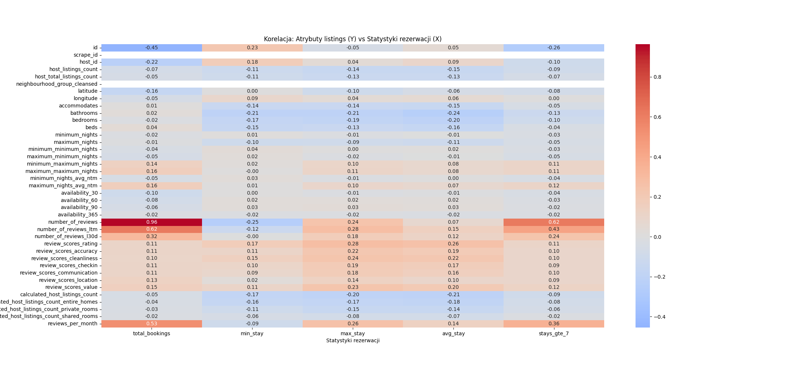
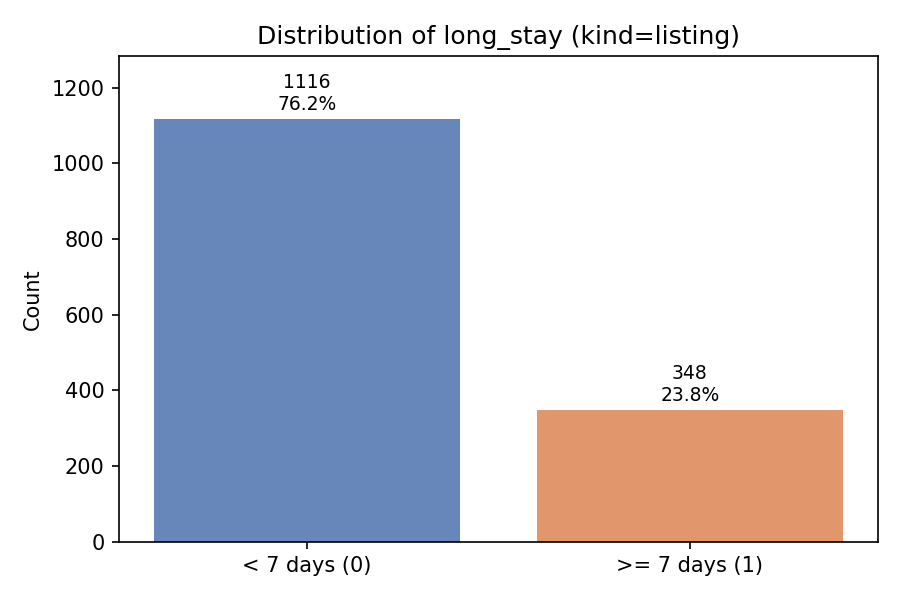

# **Etap 1**

**Autorzy:**  
- Mateusz Matukiewicz  
- Jakub Kryczka  

---

## **1. Problem**

"Nie do końca rozumiemy, jakimi kryteriami kierują się klienci, którzy rezerwują dłuższe noclegi. Taka informacja bardzo pomogłaby naszym konsultantom."

---

## **2. Założenia**

- Długie noclegi to takie, które trwają co najmniej **7 dni** (> 6.5).

Zadaniem jest zrozumienie, jakimi kryteriami kierują się klienci dokonujący długich rezerwacji, aby zwiększyć dochody i zmaksymalizować zajętość apartamentów.

W celu rozwiązania zadania zostanie zaimplementowany **model analityczny**, który pomoże sklasyfikować, czy dla danych wejściowych użytkownik dokona dłuższej rezerwacji (1 - dłuższa, 0 - w innym przypadku).

Planujemy zastowować do tego klasyfikator binarny uczony na istotnych cechach które zostały zidentyfikowane podczas analizie istotności cech której celem jest dostarczenie informacji klientowi o kryteriach wyboru klientów, co jest kluczowym elementem zrozumienia problemu biznesowego.

Porównamy również nasz wytrenowany klasyfikator binarny z *modelem bazowym* (modelem naiwnym) który bedzie przewidywać zawszę klasę większościową(krótki nocleg). A wyniki modeli porównamy używając metryk które dobrze radzą sobie z niezbalansowanymi danymi.

## **3. Analityczne kryterium sukcesu**
Model zostanie uznany dobry, jeśli jego wyniki istotnie przewyższą wyniki modelu naiwnego (model naiwny zwróci F1-score równe 0 dla klasy "długi nocleg",) przy użyciu metryk odpowiednich dla danych niezbalansowanych (np. F1-score, AP(średnią precyzją) lub ROC (AUC)). 
*Mimo że dane nie są znacząco niezbalansowane to i tak lepszym podejściem będzie używanie metryk dostosowanych do danych niezbalansowanych aby lepiej sprecyzować dokładność interesującej nas klasy "długi pobyt" (is_long_stay=1)*

Za sukces analityczny uznamy osiągnięcie **AP > 0.6** *(przy Baseline równym około 0.42 - wynikającym z częstości występowania klasy pozytywnej w danych)* oraz **F1-score > 0.65** dla klasy "długi nocleg". 
## **4. Biznesowe kryterium sukcesu**
Dostarczenie listy parametrów które najbardziej wpływają na dokonywanie długich rezerwacji oraz wzrost skuteczności sprzedaży długich noclegów o 10%

## **5. Zmienna celu**
Zmienną celu jest binarna flaga **is_long_stay**, przyjmująca wartość 1, gdy wyliczona długość noclegu (różnica między booking_duration a booking_date) wynosi co najmniej 7 dni, oraz 0 w przeciwnym razie.

## **6. Baseline**
Naiwny klasyfikator który przewiduje zawsze klase **is_long_stay=0**.
Dostajemy Średnią precyzje(AP) równa 42%.

### Overview
| Item | Value |
|-----|------|
| Model | Naive baseline (always predict `is_long_stay = 0`) |
| Test size | 1562 |
| Accuracy | 0.5768 |
| Average Precision (AP) | 0.4232 |

### Confusion Matrix  
*(rows = true labels, columns = predicted labels)*
| True \ Pred | 0 | 1 |
|------------|---|---|
| **0 (not_long_stay)** | 901 | 0 |
| **1 (long_stay)** | 661 | 0 |

### Classification Report  
*(positive class = 1)*

| Class | Precision | Recall | F1-score | Support |
|------|-----------|--------|----------|---------|
| 0 | 0.58 | 1.00 | 0.73 | 901 |
| 1 | 0.00 | 0.00 | 0.00 | 661 |
| **Accuracy** |  |  | **0.58** | 1562 |
| **Macro avg** | 0.29 | 0.50 | 0.37 | 1562 |
| **Weighted avg** | 0.33 | 0.58 | 0.42 | 1562 |

---

## **7. Dane**

1. Informacje o sesjach użytkowników oraz o tym, które apartamenty były tylko oglądane, a które faktycznie zarezerwowane.  
2. Szczegółowe dane o ofertach akomodacji, które mogą wpływać na decyzje klientów.  
3. Dane o użytkownikach.  
4. Recenzje użytkowników dotyczące konkretnych ofert.

## **8. Wstępne dane wejściowe**
Do danych wejściowych wybierzemy najbardziej skorelowane atrybuty liczbowe z pliku *listings.csv* z statystykami które wpływają na liczbę rezerwacji. (np. liczba recenzji). Natomiast jako tagów użyjemy policzonych wartości długości noclegu.

W poźniejszym etapie projektu planujemy również spróbować sparametryzować sentyment recenzji użytkowników, aby zobaczyć jak duży wpływ tekst recenzji ma na naszą funkcje celu.

---

## **9. Definicja długości noclegu**

Długość noclegu wyliczamy jako różnicę z dwóch atrybutów w danych `sessions` dla akcji rezerwacji (`action = book_listing`):    
*(aktualnie przy tej analizie danych nie obsługujemy logiki anulowania rezerwacji)*

- **booking_date – początek rezerwacji**  
- **booking_duration – koniec rezerwacji**

---

## **10. Na podstawie plików `sessions.csv` oraz `listings.csv` policzyliśmy:**

1. Łączną liczbę rezerwacji danego obiektu.  
2. Najkrótszy i najdłuższy pobyt.  
3. Średnią długość pobytu — pozwalającą analizować wpływ parametrów obiektu na długość rezerwacji.  
4. Liczbę wynajęć obiektu na więcej niż 7 dni.

---

## **11. Macierz korelacji**

Macierz korelacji istotnych atrybutów z danych **listings.csv** dla modelowania  
(aktualnie wszystkich liczbowych; później zostanie podjęta decyzja o wyborze dokładnych atrybutów):

## **12. Rozkład klas**
### Dystrybucja długich i krótkich rezewracji użytkowników

### Dystrybucja długich i krótkich rezerwacji obiektów
*Obiektowi przypisywana jest długa rezerwacja jeśli średnia długość pobytu w tym obiekcie jest większa lub równa 7*

---

## **13. Wnioski**

- **Największy wpływ** na łączną liczbę rezerwacji oraz liczbę długich rezerwacji ma **liczba opinii**.  
- Natomiast na **maksymalną długość pobytu** największy wpływ ma **ocena**, a nie liczba opinii.
